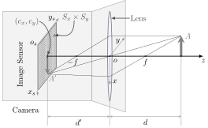

# pendulum-vision-gravimeter

A High-Resolution Pendulum Gravimetry via Computer Vision and Optical Self-Calibration!


## Project Overview

This project explores the use of a simple physical pendulum, combined with modern computer vision and careful calibration, to estimate gravitational acceleration and study pendulum dynamics at high resolution. The goals are:

- To simulate the pendulum's motion with high physical realism (including string elasticity, temperature effects, air buoyancy, etc.)
- To measure its motion using a USB webcam with high spatial and temporal resolution
- To use CV algorithms (e.g., Hough transforms) to extract motion from video
- To calibrate the camera using a known pixel-pitch display and image synthesis
- To evaluate the theoretical and experimental limits of such a system for accurate measurement


## Experimental Setup


*Figure 1: Full schematic of the pendulum and vision-based measurement system.*


*Figure 2: Mapping from pendulum coordinates to sensor pixel coordinates.*


*Figure 3: Optical model of the webcam used for motion capture.*


## System Components

### 1. Physical Setup

- Simple pendulum with adjustable string length
- Pendulum mass: spherical or cylindrical
- USB camera mounted beneath the pendulum
- Known camera distance and angle to the pendulum motion plane

### 2. Measurement Goal

- Track 2D $(x(t), y(t))$ coordinates of pendulum mass over time
- Infer motion parameters and assess measurement error
- Estimate gravity $g$ from period analysis and fitting


## Simulation and Modeling

### Features Modeled:

- Nonlinear pendulum dynamics (not small-angle approximation)
- Air drag and buoyancy (dependent on mass density and cross-sectional area)
- String elasticity (modeled via dynamic effective length)
- Thermal expansion of the string
- Motion in 2D plane (horizontal projection seen by camera)

### Implementation:

- Custom Python simulator
- Time integration via numerical solvers (e.g. Runge-Kutta 4)
- Outputs: $(x(t), y(t))$ at arbitrary resolution


## Synthetic Camera and CV Validation

### Goals:

- Test CV algorithm accuracy using synthetic ground-truth motion
- Explore effect of:
  - Frame rate
  - Image resolution
  - Illumination variation
  - Poisson (sensor) noise

### Process:

1. Generate synthetic video frames based on simulation
2. Apply noise and distortions
3. Run CV pipeline (e.g. Hough transform for circular mass)
4. Compare extracted coordinates vs known truth


## Camera Calibration and Optical Characterization

### Problem:

- The USB camera had no available datasheet
- Need to convert image pixels to real-world coordinates

### Solution:

1. Measure pixel pitch of computer monitor from datasheet (e.g. 0.27 mm)
2. Use monitor to display precise geometric patterns
3. Capture patterns at multiple distances and angles
4. Fit camera model:
   - Pinhole projection model
   - Lens distortion (barrel/pincushion)
5. Estimate:
   - Sensor pixel size
   - Field of view
   - Distortion parameters


## Real-Time Experimentation

### Pipeline:

1. Record pendulum motion in real-time using USB camera
2. Apply calibrated CV pipeline to extract motion
3. Perform statistical analysis:
   - Noise distribution
   - Autocorrelation
   - Drift over time
4. Fit motion to theoretical model to extract physical parameters


## Results and Analysis

- Accuracy of CV algorithm under various noise and lighting
- Resolution limit under real-world sensor noise
- Uncertainty in $g$ estimation from real data
- Discrepancies due to unknown length variation (highlighted as future work)


## Challenges and Future Directions

- Improve real-time measurement of **effective length** of pendulum
- Introduce stereo vision or laser-based length tracking
- Apply filtering (e.g., Kalman filter) to reduce noise and drift
- Explore unsupervised learning for visual motion extraction


## Key Takeaways

- Sub-pixel accuracy is achievable with careful calibration and modeling
- CV + simulation loop provides powerful insight into system limitations
- Modern tools allow serious experimentation with classical physics problems
- Documenting noise, distortion, and model deviation is just as important as "final values"


##  Folder Structure (Suggested)

```
├ **pendulum-vision-gravimeter**/

├── simulation/
│ └── pendulum_simulator.py
├── synthetic_data/
│ └── video_generator.py
├── camera_calibration/
│ └── monitor_grid_generator.py
├── real_data/
│ └── capture_pipeline.py
├── cv_pipeline/
│ └── hough_tracking.py
├── analysis/
│ └── fit_and_stats.ipynb
├── docs/
│ └── diagrams, plots, photos
├── README.md
└── requirements.txt
```


## Author Notes

This project was developed as a personal weekend exploration of how far a simple experimental system could be pushed using modern tools. The focus was not on publishing results but learning and integrating skills across physics, hardware calibration, simulation, and computer vision.

If you are interested in building something similar or collaborating, feel free to reach out.


## License

- **Code** in this repository is licensed under the [MIT License](./LICENSE).
- **Documentation, images, and diagrams** are licensed under [CC BY 4.0](https://creativecommons.org/licenses/by/4.0/) — you are free to share and adapt them with proper attribution.


